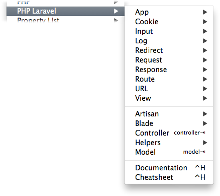

# Textmate bundle for Laravel 5

* Laravel 5 snippets
* Blade language grammar
* Artisan commands
* Helpers snippets
* Blade snippets

## Installing

	cd ~/Library/Application\ Support/Avian/Bundles/
	git clone https://github.com/loranger/Laravel.tmbundle.git
	
## Credits

Blade language grammar is based on [Medialink syntax definition](https://github.com/Medalink/laravel-blade) for Sublime Text